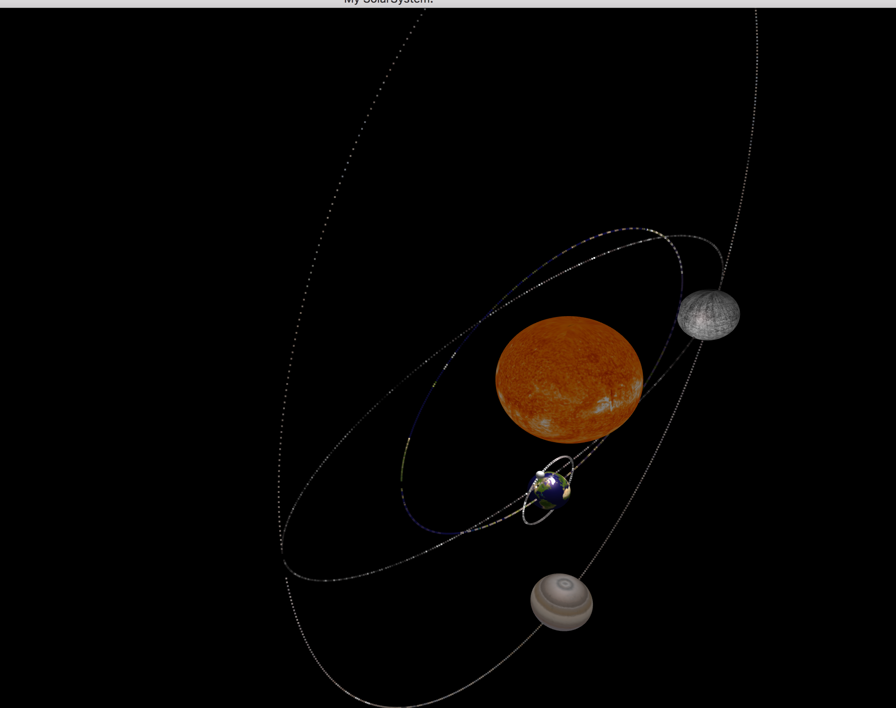

##Solar System
This is a very simple program to simulate the solar system(Well...actually we can't call it is simulating, for the planet doesn't follow the phisics law,but you can change the orbital,scale and speed of every planet).

###Installation
I use cmake

###Usage
You can use **w/a/s/d** to move forward/left/backward/right,and **i/j/k/l** to change the angle of the view.

Use **space** to trigger automatic move forward, use **p** to start/pause the movement of all the planets.

If you want to create a new planet, you just need to offer a new texture picture.
###others
I build this program on OSX 10.11, so I'm not sure the program will run correct on other platform.

###ScreenShot

